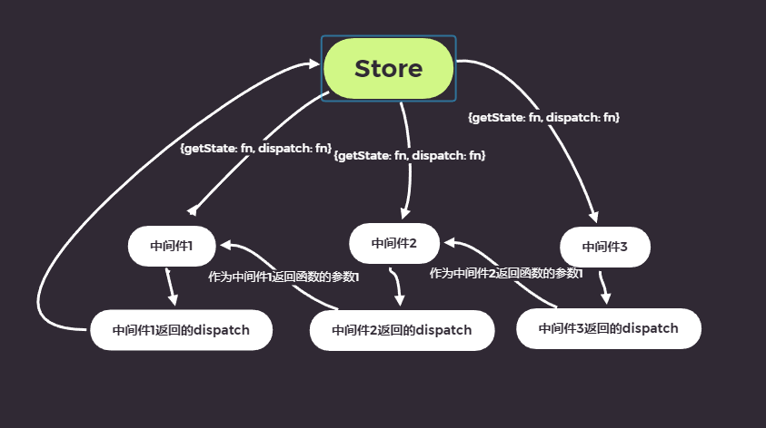

# JSX

## 规范要求: 

### 遵守XML规范, 标签必须有结束符号, 只允许存在一个根节点

## JSX表达式语法: <div>{表达式/变量}</div>

### JSX语法表达式无法展示出undefined/null/false

## 元素不可变

# 组件

## 函数组件和类组件

### 函数组件: 必须返回一个React对象

### 类组件: 必须有继承自React.Component, 必须有render()方法

## 传递参数

### 函数组件会以一个对象形式位于函数的第一个参数位置

### 类组件会以一个对象形式位于constructor的第一个参数位置

#### **组件无法改变自身属性**

# 受控组件和非受控组件

## 受控组件: 组件使用者有能力控制该组件的行为和内容, 通常该种组件无自身状态

## 非受控组件: 组件使用者没有能力控制组件的行为和内容, 组件内的行为和内容由其组件状态自行控制维护

# **注意: React思想: 数据属于谁, 谁才能有权力进行改变**

## **React中的数据都遵循单向数据流**

# 组件状态

## 组件可以自行维护的数据(组件状态只能在类组件中有效)

# 状态的变化

# 事件

## 在该标签中写入属性onXxx(小驼峰命名法), 值为函数

# 深入理解setState

## setState是异步的, 会和自己设想中的流程产生差异
## setState的第一个参数可以为函数, 函数返回对象为最终值, 第二个参数为回调函数

### 永远不要新人setState调用后某个state的状态, 如果需要state的状态则使用setState的回调函数

### 如果连续改变某个state, 则统一setState第一个参数使用函数而不是对象

# 生命周期

## 有两个版本的生命周期: 旧版生命周期: 16.0.0之前  新版生命周期: 16.0.0之后

### 旧版生命周期:

```
// *********初始化阶段开始*********
    1、constructor阶段
        1) 同一个组件只会创建一次
        2) 不能再第一次挂在到页面之前调用setState, 构造函数的constructor中严禁使用setState
// *********初始化阶段结束*********
// *********挂载阶段开始*********
    2、componentWillMount阶段
        1) 此阶段表示元素即将挂载
        2) 正常情况下只会运行一次
        3) 此阶段仍然禁止使用setState, 因为在一些特殊情况下会被调用多次, 产生bug
    3、render阶段
        1) 此阶段表示React元素被挂载到虚拟DOM树上
        2) 此阶段严禁使用setState, 因为可能会导致递归循环渲染
    4、componentDidMount阶段
        1) 此阶段表示元素正式挂载
        2) 此阶段只会执行一次
        3) 可以使用setState
        4) 通常会将一些初始化操作放置到该函数中
// *********挂载阶段结束*********
// *********更新阶段开始*********
    5、componentWillReceiveProps阶段
        1) 此阶段表示props即将变化前, 参数一为即将变化的值
        2) 该钩子在新版本生命周期时候移除掉了
    6、shouldComponentUpdate阶段
        1) 此阶段表示props/state发生变化的时候
        2) 此阶段能够操控是否重新渲染该组件, 函数返回true为重新渲染(默认), false则反之
        3) 通常会在该函数中写性能优化
    7、componentWillUpdate阶段
        1) 此阶段表示即将重新渲染组件(前提条件: shouldComponentUpdate阶段返回true)
    8、render阶段(和上面那个render做相同的事情)
    9、componentDidUpdate阶段
        1) 此阶段表示虚拟DOM已经重新挂载到页面上了
        2) 通常会把DOM操作放在该函数中
// *********更新阶段结束*********
// *********销毁阶段开始*********
    10、componentWillUnmount阶段
        1) 此阶段表示组件被销毁
        2) 通常会把依赖的一些资源或者事件进行清除操作, 例如: 计时器||事件模型
// *********销毁阶段结束*********
```

### 新版生命周期:

```
// *********初始化阶段开始*********
    1、constructor阶段
        1) 同一个组件只会创建一次
        2) 不能再第一次挂在到页面之前调用setState, 构造函数的constructor中严禁使用setState
// *********初始化阶段结束*********
// *********挂载阶段开始*********
    2、getDerivedStateFromProps阶段
        1) 此阶段表示props/state发生变化
        2) 此方法在开始就会运行一次
        3) 此方法为静态(static)方法
        4) 必须返回一个值, 返回值会覆盖当前组件的状态
    3、render阶段
        1) 此阶段表示React元素被挂载到虚拟DOM树上
        2) 此阶段严禁使用setState, 因为可能会导致递归循环渲染
    4、componentDidMount阶段
        1) 此阶段表示元素正式挂载
        2) 此阶段只会执行一次
        3) 可以使用setState
        4) 通常会将一些初始化操作放置到该函数中
// *********挂载阶段结束*********
// *********更新阶段开始*********
    5、getDerivedStateFromProps阶段
        1) 此阶段表示props/state发生变化
        2) 此方法在开始就会运行一次
        3) 此方法为静态(static)方法
        4) 必须返回一个值, 返回值会覆盖当前组件的状态
    6、shouldComponentUpdate阶段
        1) 此阶段表示props/state发生变化的时候
        2) 此阶段能够操控是否重新渲染该组件, 函数返回true为重新渲染(默认), false则反之
        3) 通常会在该函数中写性能优化
    7、render阶段(和上面那个render做相同的事情)
    8、getSnapshotBeforeUpdate阶段
        1) 此阶段表示真实DOM已经构建完成, 但还未挂载到页面上
        2) 通常会把附加的DOM操作放在该函数中
        3) 该函数必须有返回值, 返回的值会作为componentDidUpdate阶段函数的第三个参数出现
    9、componentDidUpdate阶段
        1) 此阶段表示DOM已经重新挂载到页面上了
        2) 通常会把DOM操作放在该函数中
// *********更新阶段结束*********
// *********销毁阶段开始*********
    10、componentWillUnmount阶段
        1) 此阶段表示组件被销毁
        2) 通常会把依赖的一些资源或者事件进行清除操作, 例如: 计时器||事件模型
// *********销毁阶段结束*********
```

# 传递元素

## 组件写为对标签, 在对标签内的内容会以props.children传递到子组件内

# 表单

## 表单组件默认为非受控组件

# 属性默认值

## 类组件使用 static defaultProps = {}; 函数组件使用构造函数.defaultProps = {};

# 类型检查

## 需使用官方提供的第三方库prop-types

### **prop-types**提供的类型

```
// 传入undefined/null是无法通过必填选项的
// 默认情况下，这些都是可选的。
  optionalArray: PropTypes.array, // 数组
  optionalBool: PropTypes.bool, // 布尔值
  optionalFunc: PropTypes.func, // 函数
  optionalNumber: PropTypes.number, // 数字
  optionalObject: PropTypes.object, // 对象
  optionalString: PropTypes.string, // 字符串
  optionalSymbol: PropTypes.symbol, // symbol

  // 任何东西都可以被渲染:numbers, strings, elements,或者是包含这些类型的数组(或者是片段)。
  optionalNode: PropTypes.node,

  // 一个 React 元素。
  optionalElement: PropTypes.element,

  // 你也可以声明一个 prop 是类的一个实例。 
  // 使用 JS 的 instanceof 运算符。
  optionalMessage: PropTypes.instanceOf(Message),

  // 你可以声明 prop 是特定的值，类似于枚举
  optionalEnum: PropTypes.oneOf(['News', 'Photos']),

  // 一个对象可以是多种类型其中之一
  optionalUnion: PropTypes.oneOfType([
    PropTypes.string,
    PropTypes.number,
    PropTypes.instanceOf(Message)
  ]),

  // 一个某种类型的数组
  optionalArrayOf: PropTypes.arrayOf(PropTypes.number),

  // 属性值为某种类型的对象
  optionalObjectOf: PropTypes.objectOf(PropTypes.number),

  // 一个特定形式的对象
  optionalObjectWithShape: PropTypes.shape({
    color: PropTypes.string,
    fontSize: PropTypes.number
  }),

  // 你可以使用 `isRequired' 链接上述任何一个，以确保在没有提供 prop 的情况下显示警告。
  requiredFunc: PropTypes.func.isRequired,

  // 任何数据类型的值
  requiredAny: PropTypes.any.isRequired,

  // 你也可以声明自定义的验证器。如果验证失败返回 Error 对象。不要使用 `console.warn` 或者 throw ，
  // 因为这不会在 `oneOfType` 类型的验证器中起作用。
  customProp: function(props, propName, componentName) {
    if (!/matchme/.test(props[propName])) {
      return new Error(
        'Invalid prop `' + propName + '` supplied to' +
        ' `' + componentName + '`. Validation failed.'
      );
    }
  }
```

# HOC 告诫组件

## HOC(Higher-Order Component), 高阶组件, 以组件作为参数, 并返回一个组件

## 通常可以利用HOC实现横切关注点

# ref

## 标签添加属性ref即可, 想要获取该ref标记的元素使用this.refs.ref值, 即可拿到ref标记的元素， ref的参数可以是字符串(不建议使用, 将来有可能弃用)/函数/对象

## ref也可以拿到类的实例

# ref转发

## React.forwardRef()处理函数组件无法使用ref问题

## 使用方式及其限制: React.forwardRef(函数组件), 函数组件的构造函数会收到第二个参数ref, 用于定义该函数组件内的ref值。此函数只能用于函数组件上

# Context(上下文)

## React < 16.0.0为旧版, React > 16.0.0为新版

## 当某个组件创建了上下文后, 上下文的数据会被子组件所共享。 如果某个组件依赖了上下文，会导致该组件不存粹。 一般用于第三方组件

### 旧版Context接口:

```
    export default class A extends Component {
    constructor(props) {
        super(props)
        this.state = {
            uid: '0120129',
            name: 'CodeGorgeous',
        }
    }
    // 规定上下文数据类型
    static childContextTypes = {
        uid: PropTypes.string,
        name: PropTypes.string
    }
    // 设置上下文数据
    // 该函数自动在render阶段后调用
    getChildContext() {
        return {
            uid: this.state.uid,
            name: this.state.name
        }
    }

    render() {
        return (
            <div>
                组件A
                <B />
            </div>
        )
    }

    // ******
    export default class C extends Component {
    constructor(props, context) {
        super(props)
        this.state = {}
        console.log(context) // {uid: '0120129', name: 'CodeGorgeous'}
    }
    // 必须重新明确上下文数据类型
    static contextTypes = {
        uid: PropTypes.string,
        name: PropTypes.string
    }

    render() {
        return (
            <div>
                组件C
                <h1>{this.context.uid}</h1>
                <h2>{this.context.name}</h2>
            </div>
        )
    }
}
}
```

## 新版Context接口:

### 新版本的Context将独立组件外, 多文件组件模式需要把context抽离出来, 不需要在声明类型

```
    // ***context.js***

    import React from 'react';

    const context = React.createContext({
        name: 'CodeGorgeous',
        sex: 'male',
        age: 21
    })

    /**
    * context有两个属性:
    *  Provider: 生产者, 是一个组件, 用于创建上下文, 其有value属性用于设置上下文数据
    *  Consumer: 消费者, 是一个组件, 用于获取上下文数据的一种方式, 通常在函数组件内使用该种方式获取上下文数据(类组件内也可以使用)
    *  要求使用Consumer这种方式获取上下文数据
    */

    export default context

    // ***A.jsx***

    import React, { Component } from 'react'
    import B from './B'
    import context from './context'

    // 通过context创建, React.createContext参数为数据默认值
    // 多文件需要把这个提取出来为一个文件
    // const context = React.createContext({
    //     name: 'CodeGorgeous',
    //     sex: 'male',
    //     age: 21
    // })

    export default class A extends Component {
        render() {
            const Provider = context.Provider
            return (
                <div>
                    {/* 通过设置value来设置上下文 */}
                    <Provider value={{
                        name: 'maomao',
                        sex: 'female',
                        age: 18
                    }}>
                        组件A
                        <B />
                    </Provider>
                </div>
            )
        }
    }

    // ***B.jsx***

    import React, { Component } from 'react'
    import C from './C'
    import context from './context'

    export default class B extends Component {
        render() {
            const Consumer = context.Consumer
            return (
                <Consumer>
                    {value => {
                        return (
                            <>
                                <div>
                                    组件B
                                    <h1>{value.name}</h1>
                                    <h1>{value.sex}</h1>
                                    <h1>{value.age}</h1>
                                    <C />
                                </div>
                            </>
                        )
                    }}
                </Consumer>
            )
        }
    }

    // ***C.jsx***

    import React, { Component } from 'react'
    import context from './context'

    export default class C extends Component {

        // 需要把上下文拿到, react内部把上下文放入该组件内
        static contextType = context

        render() {
            return (
                <div>
                    组件C
                    <h1>{this.context.name}</h1>
                    <h1>{this.context.sex}</h1>
                    <h1>{this.context.age}</h1>
                </div>
            )
        }
    }
    
    // ******函数组件******

    import React from 'react';
    import context from './context';

    export default function D(props) {
        const Consumer = context.Consumer
        return (
            <div>
                组件D
                {/* 在函数组件内得到上下文需要使用context.Consumer */}
                <Consumer>
                    {value => {
                        return (
                            <>
                                <h1>{value.name}</h1>
                                <h1>{value.sex}</h1>
                                <h1>{value.age}</h1>
                            </>
                        )
                    }}
                </Consumer>
            </div>
        )
    }


```

### 只有类组件才可以创建上下文(旧版本中), 一个组件/其子组件声明多个上下文, 遇到相同的属性会产生覆盖效果(类型一致), 如果中途覆盖并改变其设定类型, 则其子组件在使用时会接收到改变后的类型的数据

### 当上下文发生变化时会影响到其所有子元素, 强制所有子元素更新, 并且无视shouldComponentUpdate阶段所做的优化

# PureComponent

## 纯组件, 用于避免不必要的渲染, 从而提升效率

### 正常情况下, 父组件发生变化其下的子组件全部都会重新渲染一遍

### 用于优化, 有一些组件他的props和state没有发生变化, 却因为父组件发生变化而被迫此组件发生变化, 这种重新渲染时没有必要的

### PureComponent是一个组件, 如果某个组件继承自该组件, 那么会默认对组件进行优化，是在shouldComponentUpdate阶段进行优化, 会进行比较更新前和更新后的数据, 是**浅比较**

### 以后注意在写组件时，组件能够进行继承PureComponent就优先继承

# render props

## 算是一种思维模式(横切关注点(HOC高阶组件也是这种思想)), 某个组件需要某个属性, 该属性通用性高, 则把该属性单独做一个组件, 使用的组件外层嵌套该组件并传值进入组件即可, 可以理解这种专门提供数据的组件称之为纯组件

# Portals

## 插槽: 将一个React元素渲染到执行的容器内, 由ReactDOM所提供

## 注意即使改变了某个React的元素的容器, 可当React元素代码中放置的位置仍受到原来位置的事件冒泡所影响

# 错误边界

## 默认情况下, 若一个组件render阶段发生错误, 会导致整个组件树全部被卸载

### 错误边界就是一个组件, 专门用于捕获错误, 错误边界此概念于16.0.0版本后提出的

### 仅在子组件发生错误时会触发, 自身组件发生变化时发生错误是无法捕获到的, 异步错误也无法捕获到, 事件所发生的错误也无法捕获到

### 写法

```js
    // 写法一(推荐)
    // 增加一个生命周期getDerivedStateFromError, 此阶段运行在渲染子组件的过程中, 发生错误之后, 更新页面之前
    class ErrorBoundary extends PureComponent {

        state = {
            ifError: false
        }

        // 此方法仅在子组件发生错误时会触发, 自身组件发生变化时发生错误是无法捕获到的
        static getDerivedStateFromError(error) {
            console.log('错误发生', error)
            // 返回一个对象, 该对象会覆盖掉原来的state
            return {
                ifError: true
            }
        }
        render() {
            if (this.state.ifError) {
                return (
                    <>组件发生错误</>
                )
            } else {
                return (
                    <>{this.props.children}</>
                )
            }
        }
    }

    // 写法二(不推荐)
    // 编写生命周期componentDidCatch, 此阶段运行在渲染子组件的过程中, 发生错误, 更新页面之后
    class ErrorBoundary extends PureComponent {

        state = {
            ifError: false
        }

        componentDidCatch(error, info) {
            console.log('发生错误', error, info)
            this.setState(cur => {
                return {
                    ifError: true
                }
            })
        }

        render() {
            if (this.state.ifError) {
                return (
                    <>组件发生错误</>
                )
            } else {
                return (
                    <>{this.props.children}</>
                )
            }
        }
    }

```

# React中的事件(**没听懂**)

## React中的事件是注册在document上的, 事件处理也基本上在document上处理

### 如果给真实的DOM注册事件并阻止了事件冒泡, 则响应的react事件是无法被触发的

### React的事件所给的event是经过react包装过的, 如果需要使用原生的event则通过e.nativeEvent得到

# 渲染原理

## React元素(React Element): 通过React.createElement语法创建, JSX是这种方法的一种语法糖

```js
    // 例如:
    <div>Hello World</div>
    <App />
    // 这些都是React元素
```

## React节点: 专门用于渲染到UI界面的对象, React节点是React元素的进一步转变, 最终ReactDOM一定是通过React节点来渲染也页面

- 节点类型
    - React DOM节点: 创建该节点的React元素的type为一个字符串
    - React 组件节点: 创建该节点的React元素的type是一个函数或者类
    - React TextNode节点: 创建该节点是由字符串所创建
    - React 空节点: 由null, undefined, false所创建
    - React 数组节点: 由数组所创建的节点

### React元素最终会变为React节点, 但是React节点不一定是由React元素所创建

## 首次渲染/新节点渲染

- 通过参数创建节点
- 根据不同的节点类型执行不同的事情
    - React DOM节点: 通过document.createElement创建真实DOM, 然后设置该DOM的属性, 遍历对应的React元素的children属性, 重复递归执行最开始的的步骤, 直到遍历完成
    - React TextNode节点: 通过document.createTextNode创建真实的文本DOM
    - React 空节点: 什么都不做
    - React 数组节点: 遍历数组, 重复递归执行最开始的的步骤, 直到遍历完成
    - React 组件节点:
        - 函数组件: 必须返回一个可以生成节点的内容, 并进行递归执行最开始的的步骤, 直至结束
        - 类组件: 
            - 创建该类实例
            - 调用生命周期方法 static getDeriveStateFromProps
            - 运行render拿到可以生成节点的内容
            - 递归执行最开始的的步骤, 直至结束
            - componentDidMounted阶段执行完毕的时机是该组件内部的Dom/组件都已经生成完毕
- 生成虚拟DOM树之后会将该树保存, 以便之后使用
- 会将创建好的DOM一起加入到页面上, 不是一个个加入
```js
    // 分析下段代码写出其结构:
    const a = '1'

    const app = (
        <div>
            <h1>
                组件App
                {['CodeGorgeous', null, <p>芜湖</p>]}
            </h1>
            <p>{undefined}</p>
            <p>a: {a}</p>
        </div>
    )
    // 对应的结构称之为虚拟DOM树
    |- div
        |- h1
            |- '组件App'
            |- ['CodeGorgeous', null, <p>芜湖</p>]
                |- 'CodeGorgeous'
                |- null
                |- p
                    |- '芜湖'
        |- p
            |- undefined
        |- p
            |- 'a:'
            |- '1'
```

## 更新节点

- 更新节点的情况
    - 重新调用ReactDOM.render
    - 调用setState
        - 1: 调用生命周期函数 static getDerivedStateFromProps
        - 2: 调用生命周期函数shouldComponentUpdate, 如果函数返回false则终止后续更新操作
        - 3: 运行render重新得到一个新的节点, 并与原来保存的旧虚拟DOM树进行比较(**对比更新**)
        - 4: 将getSnapshotBeforeUpdate加入队列
        - 5: 将componentDidUpdate加入队列
        - 6: 更新虚拟DOM树并保存以便下次比较使用
        - 7: 完成真实的DOM更新
        - 8: 依次调用队列中的getSnapshotBeforeUpdate
        - 9: 依次调用队列中的componentDidUpdate

## **对比更新**

### 将新产生的节点树和旧的节点树对比并发现其差异, 完成更新

- 找到对比的目标节点
    **对于是否一致的定义:** React元素的type是否一样
    - 新节点和旧节点一致
        - **空节点**不做改变
        - **DOM节点**则直接复用此DOM对象, 无须对该节点做出改变, 并将其属性变化记录, 之后同意更新, 递归遍历此新节点(递归遍历对比更新)
        - **TextNode节点**则重用之前的DOM对象, 记录变化
        - **组件节点**(组件类型一致)
            - 函数组件: 运行函数得到一个新的节点, 递归遍历此新节点(递归遍历对比更新)
            - 类组件: 运行render方法得到一个新的节点, 递归遍历此新节点(递归遍历对比更新)
        - **数组节点** 递归遍历数组并进行对比更新
    - 新节点和旧节点不一致
        - 创建新节点, 卸载旧节点, 挂载新节点
- 未找到对比的目标节点
    - 卸载节点

### 推荐在做显示隐藏或者小幅度删除某个节点时应该提前在将要删除的位置进行空节点占位, 可大幅度提升效率, 增大元素复用度

### 元素增加key值属性可提升效率,

## 卸载节点

- **文本节点、DOM节点、数组节点、空节点、函数组件节点:** 直接放弃该节点, 并递归卸载其子节点
- **类组件节点:** 直接放弃该节点, 代用生命周期函数componentWillUnmount, 递归卸载其子节点

# 工具

## StrictMode组件, 该组件本身不进行UI渲染, 和React.Fragment(可简写为<></>)类似, 该组件会在渲染时发现不合适的代码会进行及时的警告, 例如: 使用过期的生命周期/使用过期的API/有副作用(**副作用只能写在componentDidMount/componentDidUpdate/componentWillMount阶段**)

## Profiler

### 性能分析工具, 能够检测出组件加载花费时间, 是浏览器插件React Developer Tools所提供的

# Hook

## Hook出现在React16.8.0后, 专门用于增强函数组件的功能(类组件中无法使用), 使函数组件能够做到类组件做到的事情, Hook本质就是一个函数, 该函数可以挂载任何功能

## State Hook

### 用于在函数组件中使用状态, 可以设置多个状态

```js
    import React, { useState } from 'react'

    export default function UseStateDemo(props) {
        // 会返回一个数组, 数组[0]存储的是数据, 数组[1]存储的是函数, 函数用于改变值
        const arr = useState(18)
        // 简便写法, 配合es6的解构语法
        // const [age, setAge] = useState(18)

        const [ifDisplay, setIfDisplay] = useState(true)

        return (
            <div>
                组件UseStateDemo
                <h1>
                    <button onClick={() => {
                        arr[1](arr[0] - 1)
                    }}>-</button>
                    {arr[0]}
                    <button onClick={() => {
                        arr[1](arr[0] + 1)
                    }}>+</button>
                </h1>
                <button onClick={() => {
                    setIfDisplay(!ifDisplay)
                }}>切换状态</button>
            </div>
        )
    }
```

### State Hook使用注意事项

- 严禁在判断/循环中出现useState
- 如果使用函数改变State, 并改变前后的值完全相等(Object.is), 则不会重新渲染
- 使用函数改变State, 传入的值是不会和原来的进行合并, 而是覆盖
- 设置State也可能会是异步, 不能信任设置之后的值, 应该使用函数作为重新设置State的第一项参数

# 强制刷新

- 类组件中使用this.forceUpdate()
- 函数组件中创建一个没用的State, 值为空对象{}, 每次强制刷新进行对State的重新赋值

## Effect Hook

### 用于在函数组件中处理副作用

```js
    import React, { useEffect, useState } from 'react'

    export default function EffectHookDemo() {
        console.log('渲染')
        const [num, setNum] = useState(0)
        // useEffect的第一个参数为函数, 用于写副作用, 第二个参数为数组, 称之为依赖项, 可比较副作用依赖数据的变化, 如果依赖项数据变化则执行副作用函数, 否则不执行
        useEffect(() => {
            console.log('副作用')
            document.title = num
            // 可以返回一个函数, 返回函数运行时间点是渲染之后, 副作用函数调用之前, 组件销毁前也会调用这个返回函数
            return () => {console.log('清理')}
        }, [])

        return (
            <div>
                {num}
                <button onClick={() => {
                    setNum(cur => cur + 1);
                }}>+</button>
            </div>
        )
    }
```

### Effect Hook使用注意事项

- 严禁在循环/判断中使用 

# 副作用

## ajax请求/计时器/异步操作/更改真实DOM/本地存储/会对外部产生影响的操作

## 自定义Hook

### 将一些常用的Hook功能进行抽离, 形成一个函数, 该函数就称之为自定义Hook

- 自定义Hook规则
    - 函数名必须以use开头
    - 调用自定义Hook函数时,应该放到顶层

## Reducer Hook

### 将一些数据进行单独抽离, 外部是不能直接操作其数据,只能通过其提供的函数进行数据改变操作

```js
    import { useState } from 'react'

    /**
     * 数据管理
     * @param { any } initial 数据初始值
     * @param { Function } reducer 数据操作函数
     * @returns { Object }
     */
    export function useReducer(reducer, initial, initFun) {
        const [n, setN] = useState(initFun ? initFun(initial) : initial)
        function dispatch(action) {
            const newN = reducer(n, action)
            console.log(`日志记录: 操作类型: ${action}, 数据变化:${n}->${newN}`)
            setN(newN)
        }
        return [n, dispatch]
    }
```

## Context Hook

### 用于获取上下文数据, 能够更加方便快速的获取上下文数据并且不用嵌套Consumer组件(**再次注意: Hook仅能在函数组件内使用**), 能够更加保持组件树的纯净

```js
    // ******context.js******
    import React from 'react';

    const context = React.createContext()

    export default context
    // ******A.jsx******
    import React from 'react'
    import context from './context'
    import B from './B'

    export default function A() {
        return (
            <div>
                <context.Provider value={{
                    name: 'maomao',
                    age: 15
                }}>
                    Hello A
                    <B />
                </context.Provider>
            </div>
        )
    }

    // ******B.jsx******
    import React, { useContext } from 'react'
    import context from './context'

    export default function B() {
        const confidante = useContext(context)
        console.log(confidante)
        // 旧版本写法:
        // return (
        //     <context.Consumer>
        //         {(value) => {
        //             return (
        //                 <>
        //                     <h1>name: {value.name}</h1>
        //                     <h1>age: {value.age}</h1>
        //                 </>
        //             )
        //         }}
        //     </context.Consumer>
        // )

        // 使用useContext之后的写法
        return (
            <>
                <h1>name: {confidante.name}</h1>
                <h1>age: {confidante.age}</h1>
            </>
        )
    }
```

## Callback Hook

### 用于得到一个固定引用值的函数

```js
    import React, { PureComponent, useState, useCallback } from 'react'

    export default function App(props) {
        console.log('App运行了')
        const [num, setNum] = useState(0)
        const [val, setVal] = useState(0)

        const onAClick = useCallback(() => {
            setNum(num + 1)
        }, [num])
        
        return (
            <div>
                组件App
                {/* 正常情况下下面的input改变了并不会使得A组件重新渲染, 
                    但是由于onClick的函数每次都是一个新的地址, 造成了A每次都会运行
                    使用useCallback进行对函数的
                        useCallback(fn, [])
                            fn: 固定引用的函数
                            []: 函数所依赖的数据, 如果依赖的数据发生变化则产生新的函数地址
                */}
                {/* <A value={num} onClick={() => {
                    setNum(num + 1)
                }}/> */}
                <A value={num} onClick={onAClick}/>
                <input
                    type="number"
                    value={val}
                    onChange={(e) => {
                        setVal(e.target.value)
                    }}
                />
            </div>
        )
    }

    class A extends PureComponent {
        render() {
            console.log('A运行了')
            return (
                <div>
                {this.props.value}
                <button
                    onClick={() => {
                    this. props.onClick && this.props.onClick()
                    }}
                >改变</button>
            </div>
            )
        }
    }
```

## Memo Hook

### 用于保存一些需要经过复杂计算的数据, 能够进行效率优化

```js
    import React, { PureComponent, useState, useMemo } from 'react'

    export default function App(props) {
        console.log('App运行了')
        const [num, setNum] = useState(0)
        const [val, setVal] = useState(0)

        const onAClick = useMemo(() => {
                return () => (setNum(num + 1))
        }, [num])
        
        return (
            <div>
                组件App
                {/* 正常情况下下面的input改变了并不会使得A组件重新渲染, 
                    但是由于onClick的函数每次都是一个新的地址, 造成了A每次都会运行
                    useMemo(fn, [])
                        fn: 运行函数, 函数返回值会作为useMemo的最终返回值
                        []: 函数所依赖的数据, 如果依赖的数据发生变化则产生新的函数地址
                    useMemo和useCallback的区别在于: useMemo需要返回一个你所需要的数据/函数, 而useCallback则是直接运行函数
                */}
                {/* <A value={num} onClick={() => {
                    setNum(num + 1)
                }}/> */}
                <A value={num} onClick={onAClick}/>
                <input
                    type="number"
                    value={val}
                    onChange={(e) => {
                        setVal(e.target.value)
                    }}
                />
            </div>
        )
    }

    class A extends PureComponent {
        render() {
            console.log('A运行了')
            return (
                <div>
                {this.props.value}
                <button
                    onClick={() => {
                    this. props.onClick && this.props.onClick()
                    }}
                >改变</button>
            </div>
            )
        }
    }
```

### **useMemo和useCallback的区别:** useMemo需要返回一个你所需要的数据/函数, 而useCallback则是直接运行函数, 通常useCallback能做到的useMemo是都能够做到的

## Ref Hook

### 用于设置ref标记元素, 使用方式和createRef()基本一致, 也能用于保存一些组件特有值(**特有值是指运行函数并不会产生新地址而是继续沿用旧地址**)

```js
    // ***例子一: 保存Dom
    import React, { useRef } from 'react'

    export default function App() {
        const inputRef = useRef()
        
        return (
            <div>
                <input ref={inputRef} type="text" />            
                <button
                    onClick={() => {
                        console.log(inputRef.current.value)
                    }}
                >输出</button>
            </div>
        )
    }

    // 例子二: 保存一些特有值
    import React, { useRef, useState, useEffect } from 'react'

    export default function App() {
        const [h, setH]  = useState(0)
        const [m, setM]  = useState(0)
        const [n, setN] = useState(0)
        
        const timer = useRef()
        useEffect(() => {
            if (n === 60) {
                setN(0)
                setM(m + 1)
            }
            if (n === 60) {
                setM(0)
                setH(h + 1)
            }
            
            timer.current = setTimeout(() => {
                setN(n + 1)
            }, 1000)
            return (() => {
                clearTimeout(timer.current)
            })
        }, [n])
        return (
            <div>
                <h1>{h}:{m}:{n}</h1>
            </div>
        )
    }
```

## ImperativeHandle Hook

### 用于调用一些函数组件内的一些方法

```js
    import React, { useRef, useImperativeHandle } from 'react'

    const NewA = React.forwardRef(A)

    export default function App() {
        const newARef = useRef()

        return (
            <div>
                <NewA ref={newARef}/>
                <button
                    onClick={() => {
                        console.log(newARef, newARef.current)
                    }}
                >Print</button>
            </div>
        )
    }

    function A(props, ref) {
        // 第一个参数为填写ref
        // 第二个值为函数,返回值会作为ref.current存储
        // 第三个参数为[], 是依赖项
        useImperativeHandle(ref, () => {
            return 'Hello A'
        })
        return (
            <div>
                Hello A
            </div>
        )
    }
```

## LayoutEffect Hook

### 用法和useEffect一致, 只不过运行时间点不同, LayoutEffect运行在页面渲染前(会阻塞程序), Effect运行在页面渲染后,推荐尽量使用Effect(不会阻塞程序)

## DebugValue Hook

### 用于调试, 可对自定义Hook在浏览器React插件中看到自定义Hook的自定义描述信息, 如果创建了一个通用性比较高的Hook可以使用useDebugValue(**对于自己的规定: 自定义Hook必须写useDebugValue**)

```js
    import React, { useState, useEffect, useDebugValue } from 'react'

    export default function App() {
        const [my, setMy] = useState('CodeGorgeous')
        useEffect(() => {},[])
        useTest()
        return (
            <div>
                
            </div>
        )
    }

    function useTest() {
        const [name, setName] = useState('maomao')
        const [age, setAge] = useState(15)
        useDebugValue('MyConfidante')
}
```

# React动画

## React动画库: react-transition-group

- 动画组件
    - Transition **基础**
    - CSSTransition **常用**
    - SwitchTransition **用于做两者切换**
    - TransitionGroup **用于管理列表动画**

# Router

## react-router: 路由核心库

## react-router-dom: 利用路由核心库, 结合实际页面

## 路由的两种模式

### Hash Router 哈希路由

#### 根据url中的锚点(哈希)确定组件, 兼容性好

### Browser History Router 浏览器历史记录路由

#### history添砖具有不会刷新页面的特点

## Router组件

### 提供路由模式配置, 会产生一个上下文

- 路由模式
    - HashRouter
    - BrowserRouter

## Route组件

### 用于设置路由的关键组件

- Route属性
    - path  匹配路径(不会区分路径的大小写)
    - component 匹配成功后的应显示的组件
    - sensitive 用于区分路径大小写, 默认为false不区分大小写
    - exact 精确匹配路径
    - children 会忽略使用component传递的组件, 渲染children的内容

```js
    import React from 'react'
    import { HashRouter, BrowserRouter, Route } from 'react-router-dom'

    export default function App() {

        return (
            <BrowserRouter>
                Hello World
                <Route path={"/"} component={C}/>
                <Route path={"/view/a"} component={A}/>
                <Route path={"/view/b"} component={B}/>
            </BrowserRouter>
        );
    }

    // /view/a
    function A() {
        return (
            <div>
            Hello A
            </div>
        )
    }

    // /view/b
    function B() {
        return (
            <div>
            Hello B
            </div>
        )
    }

    // /
    function C() {
        return (
            <div>
            Hello C
            </div>
        )
    }
```

## Switch组件

### 写在Switch中的Route组件, 当匹配到第一个符合的组件后就不会再向后寻找匹配的组件, **Switch子元素只能使用Route组件**

```js
    import React from 'react'
    import { HashRouter, BrowserRouter, Route, Switch } from 'react-router-dom'

    export default function App() {

        return (
        <BrowserRouter>
            Hello World
            <Switch>
            <Route path={"/"} exact component={C}>
                <h1>毛毛永远的好闺蜜</h1>
            </Route>
            <Route path={"/a"} exact component={A}/>
            <Route path={"/a/b"} exact component={B}/>
            <Route component={NotFound}/>
            </Switch>
        </BrowserRouter>
        );
    }

    // /view/a
    function A() {
        return (
            <div>
            Hello A
            </div>
        )
    }

    // /view/b
    function B() {
        return (
            <div>
            Hello B
            </div>
        )
    }

    // /
    function C() {
        return (
            <div>
            Hello C
            </div>
        )
    }

    function NotFound() {
        return (
            <div>
            <h1>404 NotFound</h1>
            <h2>您查找的页面不存在</h2>
            </div>
        )
    }
```

## 关于Route向组件内注入的属性信息

- Props:
    - history:
        - props.history.push(url, meta)
            - 进行跳转页面
            - 无法跳转到其他网站, 只能更改域名后的路径
            - meta参数可以携带数据
        - props.history.replace()
            - 和push基本类似
    - location:
        - 保存着push跳转时携带的meta信息
    - match:
        - 保存的路由匹配的先骨干信息
        - isExact为true表示当前路径是否与路由配置路径精确匹配

### 为什么不直接使用history对象?

#### window.history只能支持一种路由模式, 使用window.history.pushState方法时, 是收不到通知的, 会导致无法渲染相对应的组件

### 怎么向非路由组件内使用history等属性?

#### 使用react-router提供的高阶组件withRouter包装组件

```js
    import React from 'react'
    import { BrowserRouter, Route } from 'react-router-dom'

    export default function App() {

        return (
        <BrowserRouter>
            <Route path={'/'} exact component={A}/>
            {/* path可以使用:用于表示变量, 使用模糊匹配 */}
            {/* ?表示该值可有可无 */}
            {/* *表示任意字符 */}
            <Route path={'/b/:data?/*'} exact component={B}/>
        </BrowserRouter>
        );
    }

    function A(props) {
        return (
            <>
            Hello A
            <button
                onClick={() => {
                props.history.push('/b/a', {
                    name: 'CodeGorgeous'
                })
                }}
            >{'->'} B</button>
            </>
        )
    }

    function B(props) {
        console.log(props.history.location, props)
        return (
            <>
            Hello B
            <button
                onClick={() => {
                props.history.push('/')
                }}
            >{'-> A'}</button>
            </>
        )
    }
```

## Link组件

### 一个不会刷新页面的a标签组件

- 属性
    - to:
        - string/object
        - to={string}
        - to={
            {
                pathname: url,
                hash: '#a',
                search: '',
                state: '附带的状态信息'
            }
            } 
    - replace:
        - bool
        - 是否替换当前地址, 默认false
    - innerRef:
        - fn/object
        - 可以将内部的a元素的ref附着再传递的对象或函数参数上
```js
    // 简单实现Link组件
    import React from 'react'
    import PropTypes from 'prop-types'
    import { withRouter } from 'react-router-dom'

    function Link(props) {
        return (
            <a
                href={props.to}
                onClick={(e) => {
                    e.preventDefault()
                    if (props.replace) {
                        props.history.replace(props.to)
                    } else {
                        props.history.push(props.to)
                    }
                }}
            >
                {props.children}
            </a>
        )
    }

    Link.propTypes = {
        to: PropTypes.oneOfType([
            PropTypes.string,
            PropTypes.object,
        ]).isRequired,
        replace: PropTypes.bool
    }

    Link.defaultProps = {
        replace: false
    }

    export default withRouter(Link)
```

## NavLink

### 和Link组件具备相同的功能, 唯一不同的是当当前页面的url和to所填写的url符合时会向a标签添加一个class为active, 

- 属性
    - activeClassName:
        - 自定义改变匹配后的className
    - activeStyle:
        - 自定义匹配时使用的style
    - exact:
        - 是否精确匹配, 和Route组件的exact类似
    - sensitive:
        - 匹配是否区分大小写

## Redirect

### 自动跳转

- 属性
    - to:
        - 和Link的to一致
    - push:
        - 使用push方式进行跳转
    - from:
        - 当符合from规则才能进行重定向跳转
    - exact:
        - 是否精确匹配, 和Route组件的exact类似
    - sensitive:
        - 匹配是否区分大小写

# 简单实现Vue路由模式

```js
// ***route/index.js***
// 模仿vueRoute模式
import User from '../components/DemoEight/User'
import News from '../components/DemoEight/News'
import NewsSearch from '../components/DemoEight/NewsSearch'
import NewsDetail from '../components/DemoEight/NewsDetail'
import Home from '../components/DemoEight/Home'

const routeConfig = [
    {
        path: '/user',
        name: 'User',
        component: User
    }, {
        path: '/news',
        name: 'News',
        component: News,
        children: [
            {
                path: '/search',
                name: 'NewsSearch',
                component: NewsSearch
            }, {
                path: '/detail',
                name: 'NewsDetail',
                component: NewsDetail,
                children: [
                    {
                        path: '/my',
                        component: Home
                    }
                ]
            }
        ]
    }, {
        path: '/home',
        name: 'Home',
        component: Home
    }
]

export default routeConfig

// ***App.jsx***
import React from 'react'
import { BrowserRouter } from 'react-router-dom';
import RootRoute from './components/DemoEight/RootRoute'
import VueLink from './components/DemoEight/VueLink';

export default function App() {

    return (
      <BrowserRouter>
        <div>
          <nav>
            <VueLink to={{
              name: 'Home'
            }}>首页</VueLink>
            <VueLink to={{
              name: 'User'
            }}>我的页面</VueLink>
            <VueLink to={{
              name: 'News'
            }}>新闻页面</VueLink>
          </nav>
          <div>
            {/* 自动渲染页面 */}
            <RootRoute />
          </div>
        </div>
      </BrowserRouter>
    );
}

// ***components/DemoEight/User.jsx***
import React from 'react'

export default function User(props) {
    return (
        <div>
            <h1>User</h1>
            <div>
                {props.children}
            </div>
        </div>
    )
}

// ***components/DemoEight/Home.jsx***
import React from 'react'

export default function Home(props) {
    return (
        <div>
            <h1>Home</h1>
            <div>
                {props.children}
            </div>
        </div>
    )
}

// ***components/DemoEight/News.jsx***
import React from 'react'
import { Redirect } from 'react-router-dom'
import VueLink from './VueLink'

export default function News(props) {
    return (
        <div>
            <h1>news</h1>
            <nav>
                <VueLink to={{
                    name: 'NewsSearch'
                }}>新闻搜索页</VueLink>
                <VueLink to={{
                    name: 'NewsDetail'
                }}>新闻详情页</VueLink>
                <Redirect to='/news/search'/>
            </nav>
            <div>
                {props.children}
            </div>
        </div>
    )
}

// ***components/DemoEight/NewsSearch.jsx***
import React from 'react'

export default function NewsSearch() {
    return (
        <div>
            News Search
        </div>
    )
}

// ***components/DemoEight/NewsDetail.jsx***
import React from 'react'

export default function NewsDetail() {
    return (
        <div>
            News Detail
        </div>
    )
}

// ***components/DemoEight/RootRoute.jsx***
import React from 'react'
import { Switch, Route } from 'react-router-dom'
import routeConfig from '../../route/index'


export default function RootRoute() {
    const list = getRouteReacts(routeConfig)
    return (
        <div>
            {list}
        </div>
    )
}

function getRouteReacts(routes, basePath="") {
    const routeList = routes.map((item, index) => {
        const { children, path, component:Component, ...rest } = item
        return <Route
                    {...rest}
                    path={basePath + path}
                    key={index}
                    render={(values) => {
                        if (children) {
                            return <Component {...values}>
                                {getRouteReacts(children, basePath + path)}
                            </Component>
                        } else {
                            return <Component />
                        }
                    }}
                />
    })
    return (
        <Switch>
            {routeList}
        </Switch>
    )
}

// ***components/DemoEight/VueLink.jsx***
import React from 'react'
import { Link } from 'react-router-dom'
import searchPath from '../../utils/searchPath'

export default function VueLink({to, children, ...rest}) {
    
    if (typeof to !== 'string' && to.name) {
        // 根据name找到路由配置文件中响应的path路径
        to.name = searchPath(to.name)
        if (!to.name) {
            throw new Error(`No path matching route ${to.name} was found`)
        }
    }
    return (
        <Link to={to.name} {...rest}>{children}</Link>
    )
}

// ***utils/searchPath.js***
import routeConfig from '../route/index'

export default function searchPath(name, basePath='', route=routeConfig) {
    for (const iterator of route) {
        if (iterator.name === name) {
            return basePath + iterator.path
        } else if (iterator.children) {
            const path = searchPath(name, basePath + iterator.path, iterator.children)
            if (path) {
                return path
            }
        }
    }
}

```

## 实现路由守卫

```js
    import React, { PureComponent } from 'react'
    import { withRouter } from 'react-router-dom'


    class RouteWatch extends PureComponent {

        componentDidMount() {
            console.log(this.props)
            // 监听页面跳转
            this.listen = this.props.history.listen((location, action) => {
                this.props.onChange && this.props.onChange(location, action, this.props.location)
            })
            // 设置阻塞
            // 可以为字符串供给BrowserRouter的getUserConfirmation所用
            // 这里也可以使用函数, 函数返回true则跳转, false反之
            this.props.history.block(() => {
                // if (Math.random() > 0.5) {
                //     return true
                // } else {
                //     console.log('禁止跳转');
                //     return false
                // }
                return true
            })
        }
        
        componentWillUnmount() {
            // 关闭监听
            this.listen()
        }
        


        render() {
            return (
                <>{this.props.children}</>
            )
        }
    }

    export default withRouter(RouteWatch)
```

# Redux

## action

### 用于描述要做什么

- **注意事项**
    - action是一个plain-object(平面对象)
    - action必须拥有type属性, 用于描述此次操作
    - 为了方便/避免出错, 通常会用action创建函数来创建action(就是函数返回个平面对象罢了)
    - action应为纯函数, 不应该有副作用
    - 为了懒, 可以自行写一个自行分发的函数, 少写点代码

### 实现bindActionCreator

```js
    /**
     * 自动分发
     * @param {*} action action对象集合
     * @param {*} dispatch 分发函数
     * @returns 
     */
    export function bindActionCreators(action, dispatch) {
        // action为对象的情况
        if (typeof action === 'object') {
            const newObj = {}
            for (const key in action) {
                newObj[key] = (payload) => {
                    dispatch(action[key](payload))
                }
            }
            return newObj
        } else if (typeof action === 'function') {
            return (payload) => {
                dispatch(action(payload))
            }
        } else {
            throw new TypeError(`bindActionCreators expected an object or a function, but instead received: ${Object.prototype.toString.call(action)}.`)
        }
    }
```

## reducer

### 处理其, 用于根据action描述处理数据, 并把处理后的数据给予store

- **注意事项**
    - 一个仓库有且只有一个reducer
    - 通常情况下一个工程只会有一个仓库
    - 会在创建store时会运行一次reducer
    - 通常reducer函数内部会使用switch语法
    - reducer必须是一个没有副作用的纯函数
    - reducer函数内部不能写异步
    - redux提供有合并reducer方法(combineReducers)

### 实现combineReducers

```js
    import { v4 } from 'uuid'

    export function combineReducers(reducers) {
        // 判断是否为对象
        if (Object.prototype.toString.call(reducers) !== '[object Object]') {
            throw new Error(`Store does not have a valid reducer. Make sure the argument passed to combineReducers is an object whose values are reducers.`)
        } else {
            // 是否为平面对象
            if (reducers.__proto__ !== Object.prototype) {
                throw new Error('Action should be a flat object')
            } else {
                // 验证reducer是否会为undefined
                for (const key in reducers) {
                    if (reducers[key](undefined, {type: `@@redux/INIT${v4()}`}) === 'undefined') {
                        throw new Error(`Returned undefined during initialization. If the state passed to the reducer is undefined, you must explicitly return the initial state. The initial state may not be undefined. If you don't want to set a value for this reducer, you can use null instead of undefined.`)
                    }
                    if (reducers[key](undefined, {type: `@@redux/PROBE_UNKNOWN_ACTION${v4()}`}) === 'undefined') {
                        throw new Error(`Returned fixed value during initialization. If the state passed to the reducer is undefined, you must explicitly return the initial state. The initial state may not be undefined. If you don't want to set a value for this reducer, you can use null instead of fixed value.`)
                    }
                }
            }
        }
        return function (state = {}, action) {
            const newState = {}
            for (const key in reducers) {
                newState[key] = reducers[key](state[key], action)
            }
            return newState
        }
    }
```

## store

- **注意事项**
    - store.subscribe(() => {})可以监听状态是否变化, 该函数会返回一个函数, 返回的函数用于取消监听器
    - 通过createStore方法创建Store

### 实现createStore

```js
    import { v4 } from 'uuid'
    /**
     * 
     * @param { Function } reducer reducer
     * @param { any } initialValue 初始值
     * @param { Function } middleware
     * @returns 
     */
    export function createStore(reducer, initialValue, middleware) {
        // 中间件
        let middlewareFn = middleware;
        if (Object.prototype.toString.call(initialValue) === '[object Function]') {
            middlewareFn = initialValue
            initialValue = undefined
        }
        // 仓库数据
        let storeValue = initialValue
        // 判断传入的中间件是否为一个函数
        if (Object.prototype.toString.call(middlewareFn) === '[object Function]') {
            return middlewareFn(createStore)(reducer, storeValue)
        }
        // 监听器集合
        let watchList = []
        function dispatch(action) {
            
            // 验证action是否为对象
            if (Object.prototype.toString.call(action) !== '[object Object]') {
                throw new Error(`Actions must be plain objects. Instead, the actual type was: ${Object.prototype.toString.call(action)}. You may need to add middleware to your store setup to handle dispatching other values, such as 'redux-thunk' to handle dispatching functions. `)
            }
            // 判断action是否为一个平面对象
            if (action.__proto__ === Object.prototype) {
            // 判断action对象中是否具有type属性 
            if (!action.hasOwnProperty('type')) {
                throw new Error(`Actions may not have an undefined "type" property. You may have misspelled an action type string constant.`)
            }
            } else {
                throw new Error('Action should be a flat object')
            }
            // 到这一步就表示了action没问题
            // 运行reducer
            storeValue = reducer(storeValue, action)

            // 运行监听器
            for (const iterator of watchList) {
                iterator()
            }
        }

        // 在创建仓库的时候应调用一次reducer
        dispatch({type: `@@redux/${v4()}`})
        function getState() {
            return storeValue
        }

        function subscribe(callback) {
            watchList.push(callback)
            return function () {
                watchList = watchList.filter(item => item !== callback)
            }
        }

        return {
            dispatch,
            getState,
            subscribe
        }
    }
```


### 数据仓库, 用于存储共享数据

## redux中间件

### 中间件: 类似于插件, 会在原代码正常运行的情况下增强其功能

- **Redux中间件**
    - 中间件自身是一个函数, 接收一个store参数, 该store只有两个属性getState和dispatch
    - 中间件必须返回一个dispatch函数

```js
// 中间件书写标准格式
    function getStoreMessage(store) {
        // store上的dispatch是最初始的
        console.log('getStoreMessage中间件运行', store)
        
        // 该dispatch是下一个中间件所传过来的
        return function (dispatch) {
            return function (action) {
                console.log('中间件OldState信息:', store.getState())
                console.log('中间件Action信息:', action)
                dispatch(action)
                console.log('中间件NewState信息:', store.getState())
            }
        }
    }

    function middleware2(store) {
        console.log('中间件2')
        return function (dispatch) {
            return function (action) {
                console.log('中间件2的dispatch触发')
                dispatch(action)
            }
        }
    }
    // 中间件运行顺序总结
    // getStoreMessage中间件运行 -> 中间件2 -> 中间件OldState信息 -> 中间件Action信息 -> 中间件2的dispatch触发 -> 中间件NewState信息

    // getStoreMessage中间件运行的dispatch是运行的中间件2所返回的dispatch
```

### 实现applyMiddleware

```js
    export function applyMiddleware(...rest) {
        return function (createStore) {
            return function (reducers, initValue) {
                const store = createStore(reducers, initValue)
                let dispatch = () => {
                    throw new Error('Dispatch is temporarily unavailable')
                }
                const newStore = {
                    dispatch: store.dispatch,
                    getState: store.getState
                }
                let createDispatchList = []
                for (const iterator of rest) {
                    createDispatchList = [iterator(newStore), ...createDispatchList]
                }
                dispatch = store.dispatch
                for (const createDispatch of createDispatchList) {
                    dispatch = createDispatch(dispatch)
                }
                return {
                    ...store,
                    dispatch
                }
            }
        }
    }
```

## **Redux中间件运行关系图**



## Redux第三方库

### [redux-logger](https://www.npmjs.com/package/redux-logger)

#### 主要用于日志记录, 一般会把logger这个中间件放在最后一个

### [redux-thunk](https://www.npmjs.com/package/redux-thunk)

#### 实现redux-thunk

```js
    /* eslint import/no-anonymous-default-export: off */

    function createThunk(extra) {
        return (store) => {
            return (dispatch) => {
                return (action) => {
                    if (Object.prototype.toString.call(action) === '[object Function]') {
                        return action(dispatch, store.getState, extra)
                    } else {
                        return dispatch(action)
                    }
                }
            }
        }
    }

    const thunk = createThunk()
    thunk.withExtra = createThunk

    export default thunk
```

### [redux-promise](https://www.npmjs.com/package/redux-promise)

#### 实现redux-promise

```js
    /* eslint import/no-anonymous-default-export: off */
    import { isPlainObject, isString } from 'lodash'

    export default function(store) {
        return (dispatch) => {
            return (action) => {
                // 判断action是否为一个标准的flux的action
                if(isFluxAction(action)) {
                    if (action.payload.__proto__ === Promise.prototype) {
                        action.payload.then(resp => {
                            return dispatch({
                                ...action,
                                payload: resp
                            })
                        }).catch((err) => {
                            return dispatch({
                                ...action,
                                payload: err,
                                error: true
                            })
                        })
                    } else {
                        return dispatch(action)
                    }
                } else {
                    if (action.__proto__ === Promise.prototype) {
                        action.then(resp => {
                            return dispatch(resp)
                        }).catch(err => {
                            return dispatch({
                                ...action,
                                payload: err,
                                error: true
                            })
                        })
                    } else {
                        throw new Error(`Actions must be plain objects. Instead, the actual type was: '${Object.prototype.toString.call(action)}'. You may need to add middleware to your store setup to handle dispatching other values`)
                    }
                }
            }
        }
    }

    function isFluxAction(action) {
        return isPlainObject(action) && isString(action.type) && Object.keys(action).every(item => ['type', 'payload', 'error', 'meta'].includes(item))
    }
```

### [复习]迭代相关知识

```js
    // 迭代器
    var iterator = {
        total: 2,
        current: 0,
        next() {
            return {
                value: this.current > this.total ? undefined : this.current++,
                done: this.current > this.total
            }
        }
    }

    // 斐波那契数列迭代器
    var fibonacci = {
        one: 1,
        two: 1,
        current: 1,
        next() {
            if (this.current <= 2) {
                value = 1
            } else {
                value = this.one + this.two
                this.one = this.two
                this.two = value
            }
            this.current++
            return {
                value,
                done: false
            }
        }
    }

    // 无聊随笔写的
    // 根据传入的总次数, 直接打印相对应次数的斐波那契数列
    function printFibonacci(index) {
        let current = 1
        let fibonacci = {
            one: 1,
            two: 1,
            next() {
                if (current <= 2) {
                    value = 1
                } else {
                    value = this.one + this.two
                    this.one = this.two
                    this.two = value
                }
                current++
                return {
                    value,
                    done: current > index
                }
            }
        }
        for (let i = 0; i < index; i++) {
            console.log(fibonacci.next())
        }
    }

    // 这种返回一个迭代器的称之为迭代器创建函数
    function createFibonacci(total) {
        let current = 1
        return {
            one: 1,
            two: 1,
            next() {
                if (current <= 2) {
                    value = 1
                } else if (current > total) {
                    value = undefined
                } else {
                    value = this.one + this.two
                    this.one = this.two
                    this.two = value
                }
                current++
                return {
                    value,
                    done: current > total
                }
            }
        }
    }

    // 可迭代协议

    const iteratorFibonacci = {
        [Symbol.iterator]: function () {
            let current = 0
            let total = 10
            return {
                one: 1,
                two: 1,
                next() {
                    if (current < 2) {
                        value = 1
                    } else if (current > total) {
                        value = undefined
                    } else {
                        value = this.one + this.two
                        this.one = this.two
                        this.two = value
                    }
                    current++
                    return {
                        value,
                        done: current > total
                    }
                }
            }
        }
    }

    for (const iterator of iteratorFibonacci) {
        console.log(iterator)
    }
```

### [复习]生成器 **真的没听懂**

```js
```

### [redux-saga](https://redux-saga.js.org/)

- saga指令
    - tack指令
        - 监听action变化, 只会执行一次监听, 可死循环持续监听action
        - 会返回一个值为变化的action
        - 会阻塞
    - all指令
        - 全部指令执行完毕, 则结束
        - 用于统一管控多个指令
    - takeEvery指令
        - 持续监听action变化, 并有回调函数可用
        - 会返回一个对象, 类型为Task, 返回的对象可用于取消任务
        - 不会阻塞
        - 监控可以传值为'*', 意为监控全部action变化(前提是action.type必须是字符串)
    - takeLatest指令
        - 和takeEvery基本一致
        - 唯一不同点是会重复触发会自动取消上次的任务
    - delay指令
        - 延迟指定的毫秒数后在向后续执行
        - 阻塞
    - put指令
        - 用于重新触发action, 相当于dispatch(action)
    - call指令
        - 自动执行函数, 如果返回一个Promise则会进行等待
        - 和正常的call基本一致, 第一个参数为函数, 后续为参数, 第一个参数可以为对象/数组, 可以改变其函数的this指向
        - 正常: call(getAllStudent, 参数1, 参数2)
        - 对象: call({context: '123', fn: getAllStudent}, 参数1, 参数2)
        - 数组: call(['123', getAllStudent], 参数1, 参数2)
        - 可能阻塞(主要看传入的是否需要等待)
    - apply指令
        - 和call指令基本相同, 就是参数传递不同
        - apply也类似与原生的apply的使用方式, 参数以数组形式传入
        - 正常: apply(null, getAllStudent, [参数1, 参数2])
        - 可能阻塞(主要看传入的是否需要等待)
    - select指令
        - 用于拿到仓库的数据
        - 可以传入一个函数, 用于筛选数据
    - cps指令
        - 用于等待不是promise的回调模式的函数
        - 阻塞
    - fork指令
        - 用于开启一个新的任务
        - 会返回一个对象, 类型为Task, 返回的对象可用于取消任务
        - 不会阻塞
    - cancel指令
        - 用于取消一个/多个任务
        - 如果不传递参数则是取消自身任务线
    - cancelled指令
        - 判断当前任务线是否被cancel取消掉
    - race指令
        - 可以传入多个指令, 当某个指令结束则直接强制结束其他所有指令
        - ```yield race({a1: call(asyncGet),a2: call(asyncGet),a3: ca(asyncGet),a4: call(asyncGet),a5: call(asyncGet)})```, 例如a3最快执行完毕, 则最后返回 {a3: asyncGet()}
        - 阻塞
### 重写redux-saga

```js
// 重写的文件位置: src/utils/rewriteRedux/redux-saga
// 个人写的时候的问题: 最后写all指令是处理promise集合是出现问题, 使用Promise.all(promise集合)时无法跟踪到所有集合处理完毕, 使得all没有运行其then
```

### [redux-actions](https://www.npmjs.com/package/redux-actions)

## [react-redux](https://www.npmjs.com/package/react-redux)

### 官方出品, 用于链接redux和react

- 注意事项
    - Provider组件
        - 没有任何的UI界面, 该组件将仓库放到上下文中
    - connect高阶组件
        - 链接仓库和组件
        - 参数说明
            - 第一个参数(mapStateToProps):
                - function(state){}
                - 该函数必须返回一个对象
                - 返回的对象会在props中展开
            - 第二个参数(mapDispatchToProps)/对象(不推荐):
                - function(dispatch) {}
                - 该函数必须返回一个对象
                - 返回的对象会在props中展开
                - 当不传递这个参数, 则在组件内props会拥有一个dispatch(**不推荐, 会让组件变得混乱**)


## 展示组件

### 如果一个组件仅用于渲染一个页面, 而没有自己的状态, 通常称这种组件为展示组件

## 容器组件

### 如果一个组件仅用于提供数据, 没有自己的渲染页面UI, 通常称这种组件为容器组件

### 手写Provider和connect

```js
    // 文件位置: src/utils/rewriteRedux/react-redux
    // 只是简单实现了一下, 像是connect的ref转发并未实现
```

### 额外的API

## [connected-react-router](https://www.npmjs.com/package/connected-react-router)

### 用于将redux和router结合

# Chrome插件

## React Developer Tools

### 可以看到组件层级, 及组件内的一些数据

## Redux DevTools

### **注意: 需要项目内有redux-devtools-extension才能正常使用该插件**

